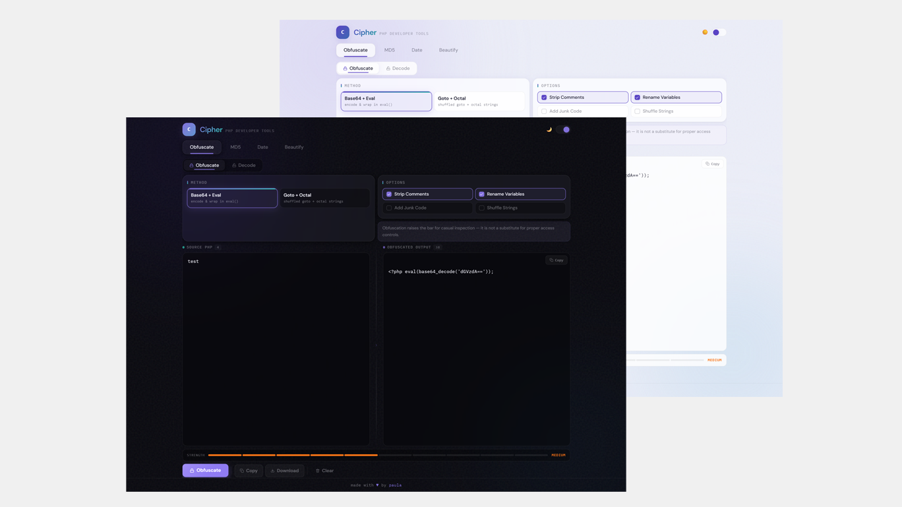

<div align="center">

# 🔐 Cipher

**A clean, fast PHP developer toolkit — built for the tools you actually reach for.**

[](https://vuejs.org)
[](https://vitejs.dev)
[](https://tailwindcss.com)
[](https://developer.mozilla.org/en-US/docs/Web/JavaScript)
[](LICENSE)

<br/>



</div>

---

## Why I Built This

At work, I kept reaching for the same tools over and over — obfuscating PHP before deployment, looking up MD5 hashes, converting Unix timestamps, cleaning up minified CSS someone dropped in a pull request. The problem was jumping between a dozen different websites, half of them cluttered, ad-ridden, or just unreliable.

So I built Cipher. One clean, fast app with everything I actually use — no distractions, no server calls, no nonsense.

---

## Tools at a Glance

| Tool | What it does |
|---|---|
| 🔒 **Obfuscate** | Make PHP code unreadable before sharing or deploying |
| 🔓 **Decode** | Reverse obfuscated PHP — auto-detects layers automatically |
| **#** **MD5** | Hash any string, or reverse-lookup a hash via online DB |
| 📅 **Date** | Convert between human dates and Unix timestamps |
| ✨ **Beautify** | Clean up minified PHP, JS, CSS, or HTML in one click |

---

## Features

- 🌙 &nbsp;Light and dark theme, persisted across sessions
- 🔍 &nbsp;Language auto-detection in the Beautify panel
- 💪 &nbsp;Real-time obfuscation strength indicator
- 📱 &nbsp;Fully responsive — desktop, tablet, and mobile
- ⚡ &nbsp;Everything runs in the browser — no server, no account, no tracking
- 🚫 &nbsp;No ads, ever

---

## How It Works

### 🔒 PHP Obfuscator
Paste your PHP and make it unreadable. Choose from multiple obfuscation methods — a simple Base64/eval wrap, Goto + octal string encoding, or multi-layer combinations. A real-time strength indicator shows exactly how hard your output is to reverse. Options include stripping comments, renaming variables, adding junk code, and shuffling strings.

### 🔓 PHP Decoder
Have obfuscated PHP you need to read? Paste it in and Cipher automatically detects the encoding layers — Base64, XOR, Goto/octal, multi-layer — and reverses them in a single click.

### # MD5
Generate an MD5 hash from any string (identical to MySQL's `MD5()` function), or paste a hash and look up the original value via reverse-lookup.

### 📅 Date & Timestamp
Convert in both directions. Type a date like `March 22, 2026` and get the Unix timestamp. Paste a timestamp and get the human-readable date back. All results use your local timezone automatically.

### ✨ Beautify
Paste minified or messy code and get it back clean and readable. Supports PHP, JavaScript / TypeScript, CSS / SCSS, and HTML. Configurable indent style (spaces or tabs), indent size, and quote style. Language is auto-detected from what you paste, and a before/after line diff shows exactly how much the code expanded.

---

## Tech Stack

| Layer | Technology |
|---|---|
| Framework | Vue 3 — Composition API, `<script setup>` |
| Build tool | Vite 5 |
| Styling | Tailwind CSS v3 + CSS custom properties |
| Fonts | DM Sans + IBM Plex Mono via Google Fonts |
| PHP formatting | [Prettier](https://prettier.io) + [@prettier/plugin-php](https://github.com/prettier/plugin-php) in a Web Worker |
| MD5 reverse lookup | [md5.gromweb.com](https://md5.gromweb.com) + [md5decrypt.net](https://md5decrypt.net) |

---

## Getting Started

```bash
git clone https://github.com/paulaxisabel/cipher.git
cd cipher
npm install
npm run dev
```

Open `http://localhost:5173` in your browser.

```bash
# Production build
npm run build
```

---

## Project Structure

```
cipher/
├── src/
│   ├── main.js                  # App entry point
│   ├── style.css                # Tailwind + CSS variables + design system
│   ├── utils.js                 # All logic — obfuscation, MD5, date, beautify
│   ├── App.vue                  # Root layout, tabs, theme toggle, toast
│   └── components/
│       ├── ObfuscatePanel.vue   # PHP obfuscator + decoder
│       ├── MD5Panel.vue         # MD5 encode + reverse lookup
│       ├── DatePanel.vue        # Date ↔ Unix timestamp converter
│       └── BeautifyPanel.vue    # Code beautifier (PHP, JS, CSS, HTML)
├── index.html
├── vite.config.js
├── tailwind.config.js
└── package.json
```

---

## Future Enhancements

- **More obfuscation methods** — ROT13, Hex, XOR, and multi-layer are already implemented in `utils.js` but not yet exposed in the UI
- **More language support in Beautify** — JSON, SQL, and XML are natural next additions
- **Export / share links** — generate a URL with code and settings pre-filled so you can send a snippet to someone directly
- **Syntax highlighting** — upgrade the plain textareas to color-coded editors
- **MD5 batch mode** — hash multiple strings at once instead of one at a time
- **Keyboard shortcuts** — trigger the active tool with `Ctrl+Enter` without touching the mouse
- **Copy as PHP snippet** — wrap MD5 or timestamp output in ready-to-paste PHP code
- **PWA support** — make Cipher installable and fully usable offline

---

## License

MIT — free to use, modify, and build on.

---

<div align="center">

Built with ❤️ by <a href="https://github.com/paulaxisabel">@paulaxisabel</a>

</div>